# Mirai

Mirai (palavra japonesa para "futuro") é uma ferramenta de gerenciamento de projetos que visa ajudar equipes a colaborar e gerenciar seus projetos de forma mais eficaz.

## Funcionalidades

  

    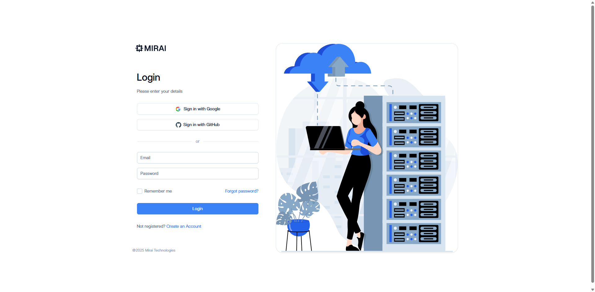
    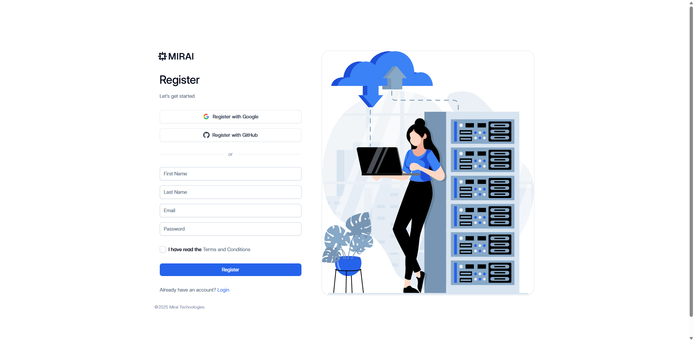
  

  

    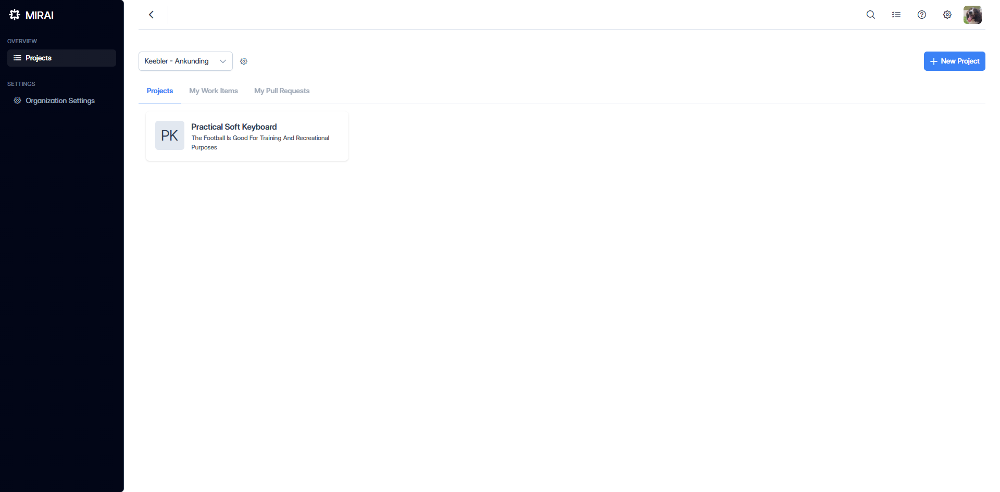
    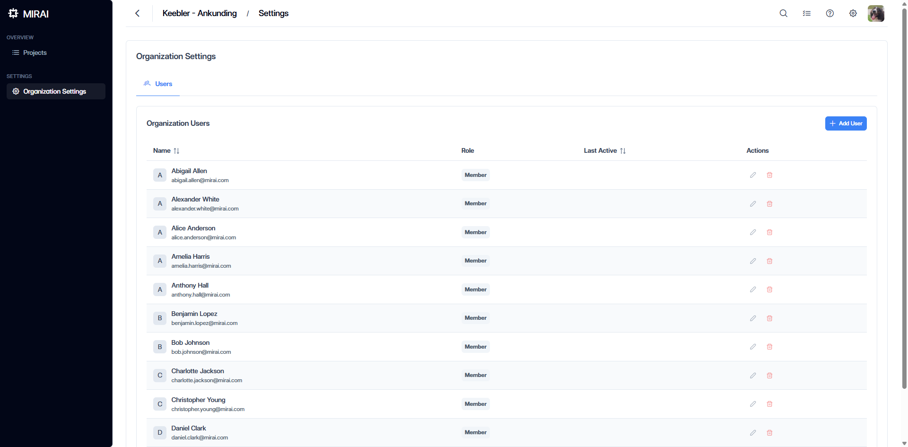
  

  

    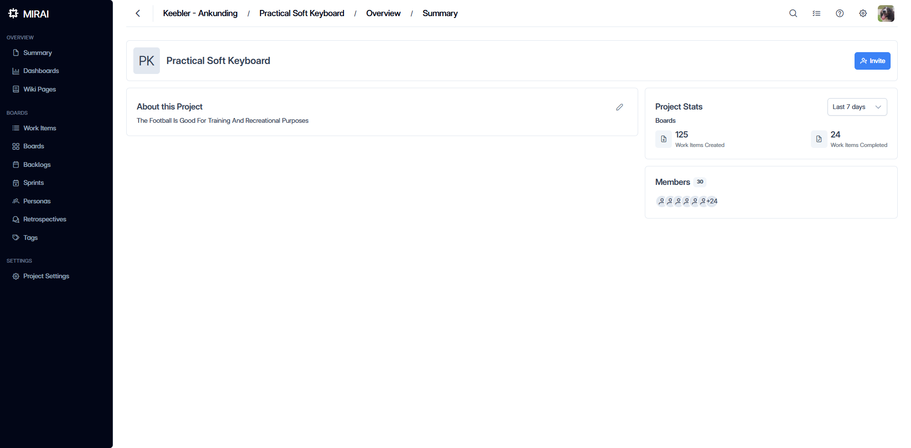
    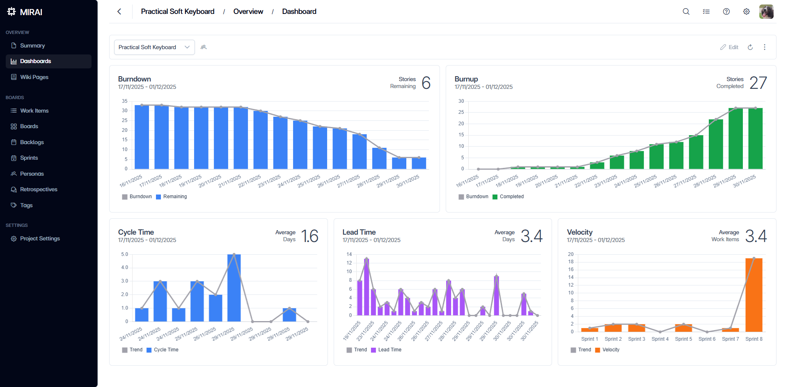
  

  

    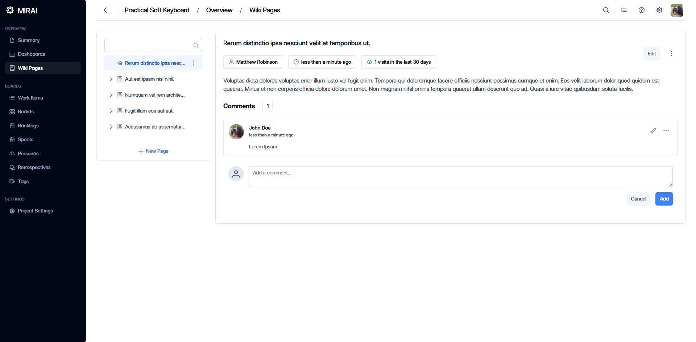
    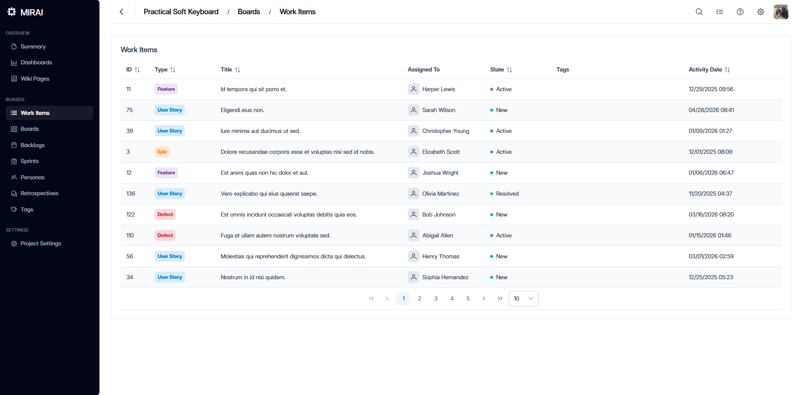
  

  

    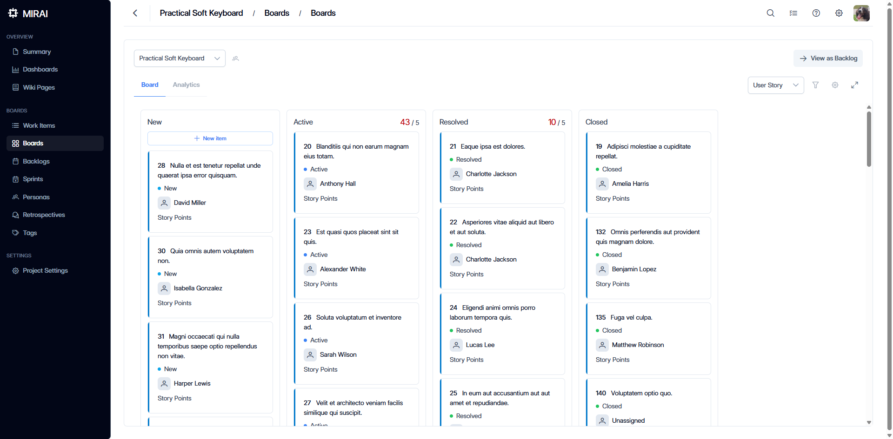
    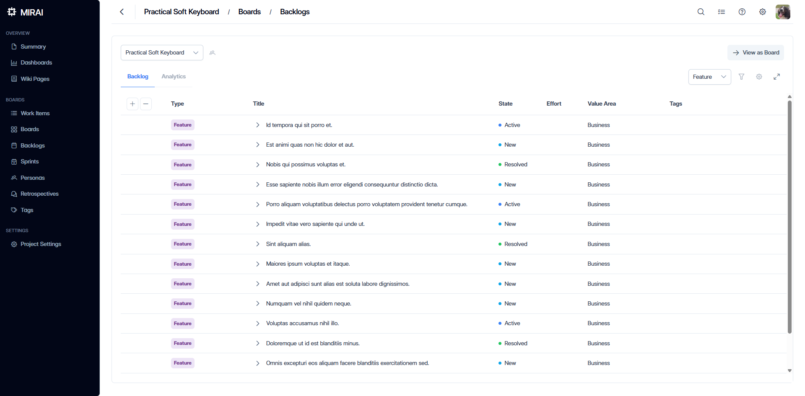
  

  

    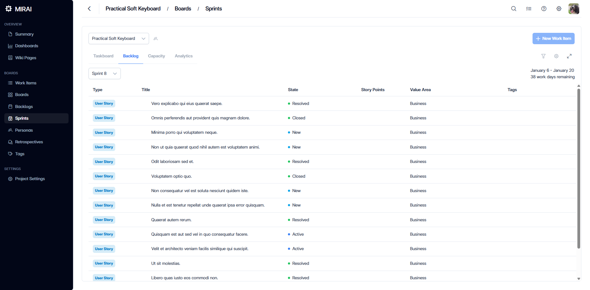
    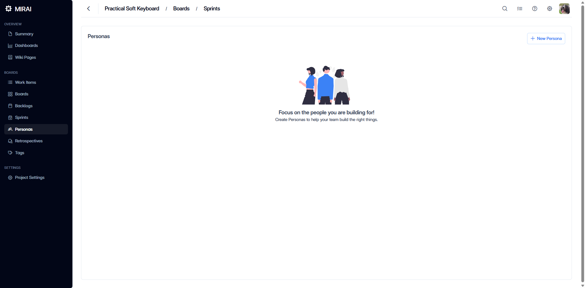
  

  

    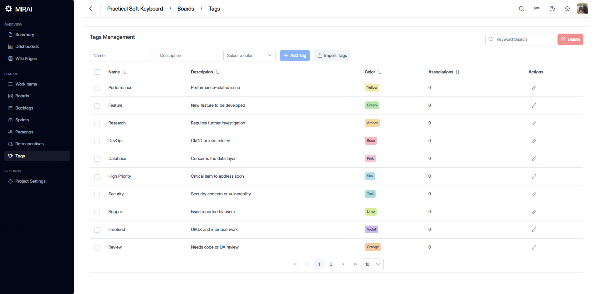
    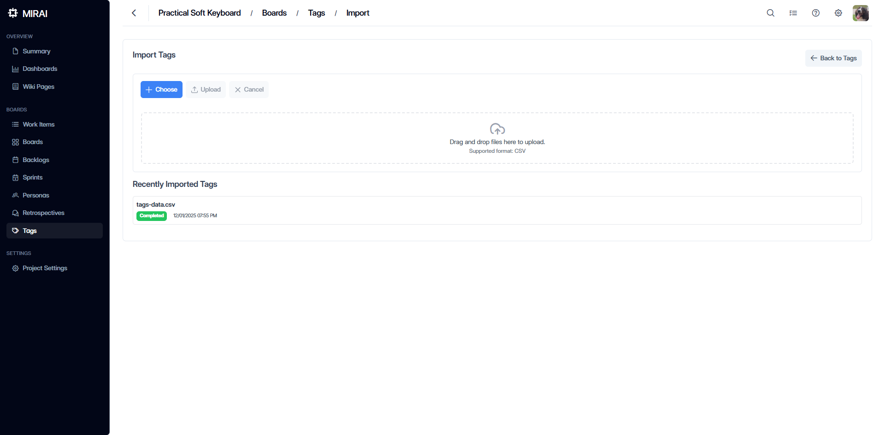
  

  

    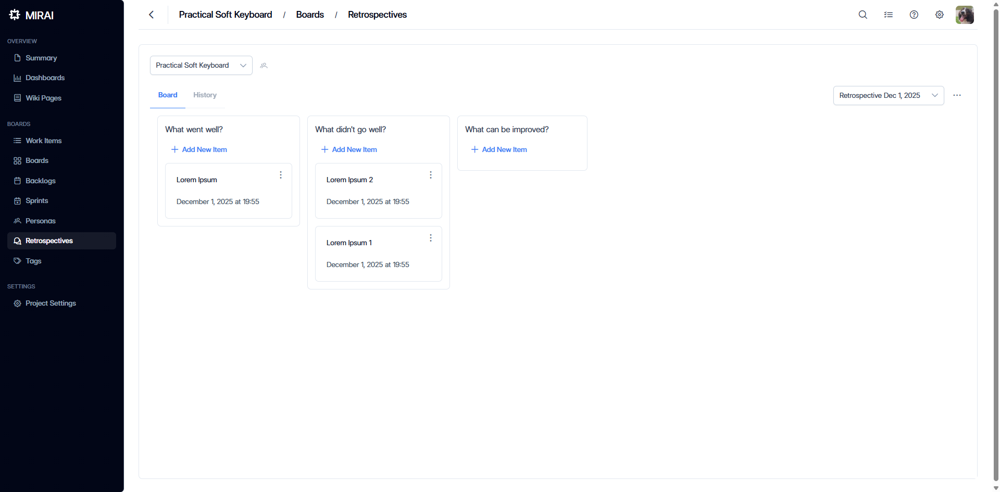
    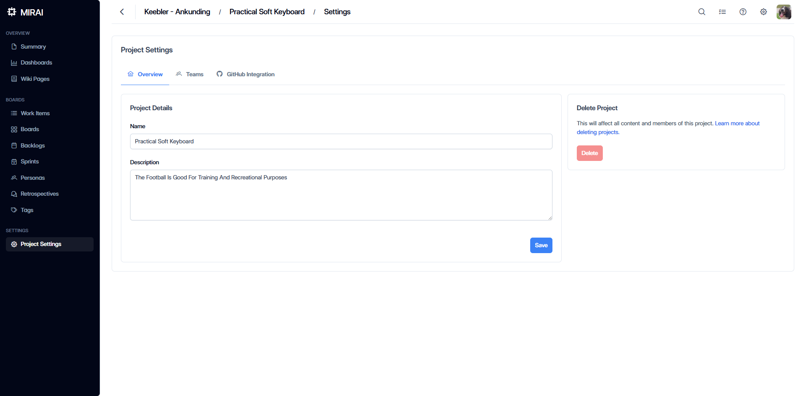
  

## Repositórios

## Tecnologias

**Backend**: ASP.NET Core 9, C# 11, .NET Aspire, PostgreSQL + PgVector, Redis, Azure, OpenAI (GPT-4o-mini + Embeddings), SignalR, Quartz.NET, MediatR + CQRS, FluentValidation, EF Core 9, OpenTelemetry, Serilog, xUnit + Testcontainers

**Frontend**: Vue 3 + TypeScript, Vite, Pinia, Vue Router, PrimeVue, TailwindCSS, Chart.js, Quill, SignalR Client, Vitest + Playwright

**Docs**: VitePress
